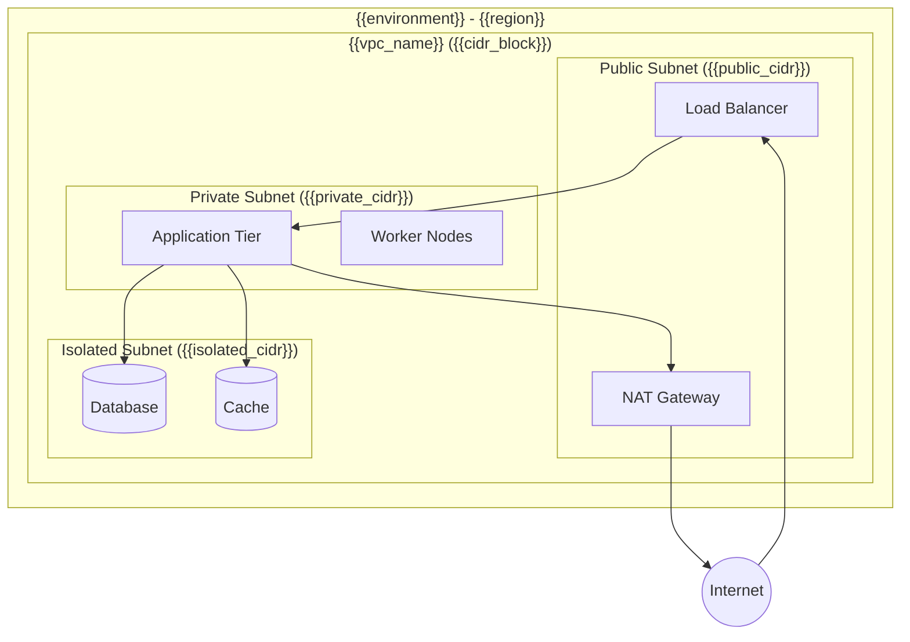

<!-- Powered by BMAD Method -->

<!-- GUIDANCE:
  This template guides creation of a comprehensive Infrastructure Architecture document.
  It is designed to be used by the DevOps Infrastructure Specialist (Alex) agent via
  the [IA] Infrastructure Architecture menu action.

  WORKFLOW:
  1. Load project configuration to resolve {{variables}} throughout this template.
  2. Work through each section interactively with the user, filling in placeholders.
  3. Cross-reference PRD Technical Assumptions with infrastructure decisions in every section.
  4. Address all feasibility concerns before finalizing the architecture.
  5. Validate the completed document against the infrastructure checklist during the
     verification phase (see _bmad/infra/data/infrastructure-checklist.md).
  6. Save the final document to {infra_artifacts}/infrastructure-architecture-{{date}}.md

  CRITICAL RULES:
  - All infrastructure MUST be defined as code. No manual resource creation in production environments.
  - Principle of least privilege for all access controls.
  - DR procedures must be tested at least quarterly.
  - Cross-reference PRD Technical Assumptions with infrastructure decisions.
  - Address all feasibility concerns before finalizing architecture.
  - Validate against infrastructure checklist during verification phase.

  PLACEHOLDER CONVENTIONS:
  - {{variable}} markers indicate fields that must be filled in during document creation.
  - <!-- GUIDANCE: --> comments provide instructions and should be removed from the final document.
  - Bullet points under each section heading describe the expected content and considerations.
-->

---
document_type: infrastructure-architecture
version: "{{version}}"
date: "{{date}}"
author: "{{author}}"
project: "{{project_name}}"
cloud_provider: "{{infra_cloud_provider}}"
container_platform: "{{infra_container_platform}}"
iac_tool: "{{infra_iac_tool}}"
gitops_tool: "{{infra_gitops_tool}}"
status: draft
---

# {{project_name}} Infrastructure Architecture

## 1. Infrastructure Overview

<!-- GUIDANCE:
  Provide a high-level summary of the infrastructure landscape. This section should
  give any reader a clear understanding of what is being built, where it runs, and why
  key decisions were made. Reference the PRD Technical Assumptions section to ensure
  alignment between product requirements and infrastructure capabilities.
-->

### 1.1 Cloud Provider(s) and Rationale

- **Primary Provider:** {{primary_cloud_provider}}
- **Secondary Provider(s):** {{secondary_cloud_providers_or_none}}
- **Selection Rationale:** {{cloud_provider_rationale}}

<!-- GUIDANCE:
  Explain why this provider was chosen. Consider: existing organizational expertise,
  service availability, compliance requirements, cost constraints, geographic coverage,
  and any contractual obligations. If multi-cloud, justify the added complexity.
-->

### 1.2 Core Services Inventory

| Service Category | Service/Product | Purpose | Criticality |
| --- | --- | --- | --- |
| Compute | {{compute_service}} | {{purpose}} | {{critical/high/medium/low}} |
| Networking | {{networking_service}} | {{purpose}} | {{critical/high/medium/low}} |
| Storage | {{storage_service}} | {{purpose}} | {{critical/high/medium/low}} |
| Database | {{database_service}} | {{purpose}} | {{critical/high/medium/low}} |
| Identity | {{identity_service}} | {{purpose}} | {{critical/high/medium/low}} |
| Monitoring | {{monitoring_service}} | {{purpose}} | {{critical/high/medium/low}} |
| {{additional_category}} | {{additional_service}} | {{purpose}} | {{critical/high/medium/low}} |

### 1.3 Regional Architecture and Availability Strategy

- **Primary Region:** {{primary_region}}
- **Secondary Region(s):** {{secondary_regions_or_none}}
- **Availability Zone Strategy:** {{az_strategy}}
- **Data Residency Requirements:** {{data_residency_requirements}}

### 1.4 Multi-Environment Strategy

| Environment | Purpose | Region(s) | Scale Factor | Access |
| --- | --- | --- | --- | --- |
| Development | {{dev_purpose}} | {{dev_region}} | {{dev_scale}} | {{dev_access}} |
| Staging | {{staging_purpose}} | {{staging_region}} | {{staging_scale}} | {{staging_access}} |
| UAT | {{uat_purpose}} | {{uat_region}} | {{uat_scale}} | {{uat_access}} |
| Production | {{prod_purpose}} | {{prod_region}} | {{prod_scale}} | {{prod_access}} |

### 1.5 Key Architectural Decisions and Constraints

<!-- GUIDANCE:
  List the major decisions that shape this architecture. Each should reference the
  driving requirement (from PRD, compliance, budget, etc.) and any trade-offs accepted.
-->

| Decision | Rationale | Trade-offs | PRD Reference |
| --- | --- | --- | --- |
| {{decision_1}} | {{rationale}} | {{tradeoffs}} | {{prd_ref}} |
| {{decision_2}} | {{rationale}} | {{tradeoffs}} | {{prd_ref}} |
| {{decision_3}} | {{rationale}} | {{tradeoffs}} | {{prd_ref}} |

---

## 2. Infrastructure as Code (IaC)

<!-- GUIDANCE:
  Define how all infrastructure is codified, versioned, and managed. This section
  establishes the foundational practice that all other sections depend on.

  CRITICAL RULE: All infrastructure must be defined as code. No manual resource
  creation in production environments.
-->

### 2.1 IaC Tool Selection and Rationale

- **Primary IaC Tool:** {{infra_iac_tool}}
- **Version:** {{iac_tool_version}}
- **Selection Rationale:** {{iac_rationale}}
- **Supplementary Tools:** {{supplementary_iac_tools_or_none}}

### 2.2 Repository Structure

<!-- GUIDANCE:
  Define how IaC repositories are organized. Consider mono-repo vs. multi-repo,
  separation of concerns (network, compute, data, platform), and how environments
  are differentiated.
-->

```
{{iac_repo_name}}/
├── {{top_level_structure}}
│   ├── {{module_or_component_1}}/
│   │   ├── {{resource_files}}
│   │   └── {{variable_files}}
│   ├── {{module_or_component_2}}/
│   └── {{shared_modules}}/
├── environments/
│   ├── dev/
│   ├── staging/
│   └── prod/
├── {{additional_directories}}
└── {{configuration_files}}
```

### 2.3 State Management Approach

- **State Backend:** {{state_backend}}
- **State Locking:** {{state_locking_mechanism}}
- **State Encryption:** {{state_encryption_approach}}
- **State Backup:** {{state_backup_strategy}}
- **State Access Controls:** {{state_access_controls}}

### 2.4 Module/Component Organization

<!-- GUIDANCE:
  Describe how reusable components are structured, versioned, and shared across
  environments and teams.
-->

- **Module Registry:** {{module_registry_or_approach}}
- **Versioning Strategy:** {{module_versioning}}
- **Dependency Management:** {{dependency_management}}
- **Testing Approach:** {{iac_testing_approach}}

> **CRITICAL RULE:** All infrastructure must be defined as code. No manual resource creation in production environments. Any exceptions require documented approval with a remediation timeline.

---

## 3. Environment Configuration

<!-- GUIDANCE:
  Detail how environments are structured, how parity between them is maintained,
  and how changes flow from development to production. Environment configuration
  drift is a common source of production incidents.
-->

### 3.1 Environment Strategy

| Environment | Purpose | Lifecycle | Owner |
| --- | --- | --- | --- |
| Development | {{dev_env_purpose}} | {{dev_lifecycle}} | {{dev_owner}} |
| Staging | {{staging_env_purpose}} | {{staging_lifecycle}} | {{staging_owner}} |
| UAT | {{uat_env_purpose}} | {{uat_lifecycle}} | {{uat_owner}} |
| Production | {{prod_env_purpose}} | {{prod_lifecycle}} | {{prod_owner}} |

### 3.2 Environment Parity Approach

- **Infrastructure Parity:** {{infra_parity_description}}
- **Configuration Parity:** {{config_parity_description}}
- **Data Parity:** {{data_parity_description}}
- **Acceptable Deviations:** {{acceptable_deviations}}

<!-- GUIDANCE:
  Document any known differences between environments and the justification for each.
  Strive for production-like environments wherever feasible to reduce deployment risk.
-->

### 3.3 Promotion Workflows Between Environments

```
{{promotion_flow_description}}

Example: dev --> staging --> UAT --> production
```

- **Promotion Triggers:** {{promotion_triggers}}
- **Approval Gates:** {{approval_gates}}
- **Automated Validations:** {{automated_validations}}
- **Rollback Procedures:** {{rollback_procedures}}

### 3.4 Environment-Specific Configurations and Overrides

<!-- GUIDANCE:
  List configuration values that differ between environments (resource sizes, feature
  flags, endpoint URLs, scaling parameters). Sensitive values should reference secrets
  management, not be listed here.
-->

| Configuration | Dev | Staging | UAT | Production |
| --- | --- | --- | --- | --- |
| {{config_key_1}} | {{dev_val}} | {{staging_val}} | {{uat_val}} | {{prod_val}} |
| {{config_key_2}} | {{dev_val}} | {{staging_val}} | {{uat_val}} | {{prod_val}} |
| {{config_key_3}} | {{dev_val}} | {{staging_val}} | {{uat_val}} | {{prod_val}} |

---

## 4. Network Architecture

<!-- GUIDANCE:
  Define the network topology, security boundaries, and traffic flow. This is one of
  the most critical sections for security and operational reliability. Include CIDR
  ranges, subnet strategies, and connectivity between environments.
-->

### 4.1 VPC/VNet Design with CIDR Allocations

| VPC/VNet | Environment | CIDR Block | Purpose |
| --- | --- | --- | --- |
| {{vpc_name_1}} | {{environment}} | {{cidr_block}} | {{purpose}} |
| {{vpc_name_2}} | {{environment}} | {{cidr_block}} | {{purpose}} |
| {{vpc_name_3}} | {{environment}} | {{cidr_block}} | {{purpose}} |

### 4.2 Subnet Strategy

| Subnet | VPC/VNet | CIDR | Type | AZ | Purpose |
| --- | --- | --- | --- | --- | --- |
| {{subnet_name_1}} | {{vpc}} | {{cidr}} | Public | {{az}} | {{purpose}} |
| {{subnet_name_2}} | {{vpc}} | {{cidr}} | Private | {{az}} | {{purpose}} |
| {{subnet_name_3}} | {{vpc}} | {{cidr}} | Isolated | {{az}} | {{purpose}} |

<!-- GUIDANCE:
  - Public subnets: Resources requiring direct internet access (load balancers, bastion hosts)
  - Private subnets: Application workloads with outbound internet via NAT
  - Isolated subnets: Data stores and sensitive workloads with no internet access
-->

### 4.3 Security Zones and Segmentation

- **DMZ / Edge Zone:** {{dmz_description}}
- **Application Zone:** {{application_zone_description}}
- **Data Zone:** {{data_zone_description}}
- **Management Zone:** {{management_zone_description}}
- **Inter-Zone Communication Rules:** {{inter_zone_rules}}

### 4.4 Load Balancers and Traffic Management

- **External Load Balancer:** {{external_lb}}
- **Internal Load Balancer:** {{internal_lb}}
- **DNS Strategy:** {{dns_strategy}}
- **CDN / Edge Caching:** {{cdn_strategy}}
- **SSL/TLS Termination:** {{tls_termination_point}}

### 4.5 Network Diagram

<!-- GUIDANCE:
  Replace the placeholder below with an accurate Mermaid diagram reflecting the
  actual network topology. Include VPCs, subnets, load balancers, NAT gateways,
  peering connections, and external connectivity.
-->



---

## 5. Compute Resources

<!-- GUIDANCE:
  Detail the compute strategy including containerization, orchestration, sizing,
  and scaling. Reference the container platform selected in module configuration.
-->

### 5.1 Container Strategy

- **Container Platform:** {{infra_container_platform}}
- **Container Runtime:** {{container_runtime}}
- **Container Registry:** {{container_registry}}
- **Image Build Strategy:** {{image_build_strategy}}
- **Base Image Policy:** {{base_image_policy}}

### 5.2 Cluster Configuration and Sizing

<!-- GUIDANCE:
  Define the cluster topology for each environment. Include control plane
  configuration, worker node specifications, and any managed service details.
-->

| Cluster | Environment | Control Plane | Worker Nodes | Instance Type | Purpose |
| --- | --- | --- | --- | --- | --- |
| {{cluster_name_1}} | {{environment}} | {{cp_config}} | {{worker_count}} | {{instance_type}} | {{purpose}} |
| {{cluster_name_2}} | {{environment}} | {{cp_config}} | {{worker_count}} | {{instance_type}} | {{purpose}} |

### 5.3 Node Pools and Workload Isolation

| Node Pool | Instance Type | Min | Max | Labels/Taints | Workloads |
| --- | --- | --- | --- | --- | --- |
| {{pool_name_1}} | {{instance_type}} | {{min}} | {{max}} | {{labels_taints}} | {{workloads}} |
| {{pool_name_2}} | {{instance_type}} | {{min}} | {{max}} | {{labels_taints}} | {{workloads}} |
| {{pool_name_3}} | {{instance_type}} | {{min}} | {{max}} | {{labels_taints}} | {{workloads}} |

### 5.4 Auto-Scaling Approach

- **Cluster Autoscaler:** {{cluster_autoscaler_config}}
- **Horizontal Pod Autoscaler:** {{hpa_strategy}}
- **Vertical Pod Autoscaler:** {{vpa_strategy}}
- **Scaling Metrics:** {{scaling_metrics}}
- **Scaling Boundaries:** {{scaling_boundaries}}
- **Cool-Down Periods:** {{cooldown_periods}}

### 5.5 Serverless Components

<!-- GUIDANCE:
  If applicable, document serverless functions, managed containers, or event-driven
  compute. If not applicable, state "Not applicable" with justification.
-->

- **Serverless Platform:** {{serverless_platform_or_na}}
- **Use Cases:** {{serverless_use_cases}}
- **Integration Points:** {{serverless_integration_points}}

---

## 6. Data Resources

<!-- GUIDANCE:
  Define the data layer including databases, object storage, caching, and data
  lifecycle management. Pay particular attention to backup, recovery, and
  replication strategies as these directly impact RTO/RPO commitments.
-->

### 6.1 Database Deployment Strategy

| Database | Engine | Version | Environment | Deployment Model | Purpose |
| --- | --- | --- | --- | --- | --- |
| {{db_name_1}} | {{engine}} | {{version}} | {{environment}} | {{managed/self-hosted}} | {{purpose}} |
| {{db_name_2}} | {{engine}} | {{version}} | {{environment}} | {{managed/self-hosted}} | {{purpose}} |

### 6.2 Backup and Recovery Approach

| Resource | Backup Frequency | Retention | Recovery Method | RTO | RPO |
| --- | --- | --- | --- | --- | --- |
| {{resource_1}} | {{frequency}} | {{retention}} | {{recovery_method}} | {{rto}} | {{rpo}} |
| {{resource_2}} | {{frequency}} | {{retention}} | {{recovery_method}} | {{rto}} | {{rpo}} |

### 6.3 Replication Patterns

- **Primary Replication Strategy:** {{replication_strategy}}
- **Read Replica Configuration:** {{read_replica_config}}
- **Cross-Region Replication:** {{cross_region_replication}}
- **Replication Lag Tolerance:** {{replication_lag_tolerance}}

### 6.4 Data Migration Strategy

- **Migration Approach:** {{migration_approach}}
- **Migration Tools:** {{migration_tools}}
- **Schema Management:** {{schema_management}}
- **Data Validation:** {{data_validation_approach}}
- **Rollback Plan:** {{migration_rollback_plan}}

### 6.5 Storage Tiers and Lifecycle Policies

| Storage Type | Tier | Use Case | Lifecycle Policy | Cost Optimization |
| --- | --- | --- | --- | --- |
| {{storage_type_1}} | {{tier}} | {{use_case}} | {{lifecycle_policy}} | {{cost_optimization}} |
| {{storage_type_2}} | {{tier}} | {{use_case}} | {{lifecycle_policy}} | {{cost_optimization}} |

---

## 7. Security Architecture

<!-- GUIDANCE:
  Security is non-negotiable. This section must be comprehensive and address identity,
  network, data, and application security. Every control should reference the threat
  or compliance requirement it addresses.

  CRITICAL RULE: Principle of least privilege for all access controls.
-->

### 7.1 IAM Strategy and Identity Management

- **Identity Provider:** {{identity_provider}}
- **Authentication Method:** {{authentication_method}}
- **MFA Enforcement:** {{mfa_policy}}
- **Service Account Strategy:** {{service_account_strategy}}
- **Role Hierarchy:** {{role_hierarchy}}
- **Access Review Cadence:** {{access_review_cadence}}

### 7.2 Network Security

- **Firewall Strategy:** {{firewall_strategy}}
- **Security Groups / NSGs:** {{security_group_approach}}
- **NACLs / Network Policies:** {{nacl_approach}}
- **WAF Configuration:** {{waf_configuration}}
- **DDoS Protection:** {{ddos_protection}}
- **Private Endpoints:** {{private_endpoint_strategy}}

### 7.3 Encryption Strategy

| Scope | Method | Key Management | Rotation Policy |
| --- | --- | --- | --- |
| Data at Rest | {{at_rest_encryption}} | {{key_management}} | {{rotation_policy}} |
| Data in Transit | {{in_transit_encryption}} | {{cert_management}} | {{rotation_policy}} |
| Secrets | {{secrets_encryption}} | {{secrets_key_mgmt}} | {{rotation_policy}} |
| Backups | {{backup_encryption}} | {{backup_key_mgmt}} | {{rotation_policy}} |

### 7.4 Secrets Management

- **Secrets Manager:** {{secrets_manager}}
- **Secret Injection Method:** {{secret_injection_method}}
- **Rotation Policy:** {{secret_rotation_policy}}
- **Access Audit:** {{secret_access_audit}}
- **Emergency Rotation Procedure:** {{emergency_rotation_procedure}}

### 7.5 Compliance Requirements and Controls

| Requirement | Standard/Regulation | Control Implementation | Validation Method |
| --- | --- | --- | --- |
| {{requirement_1}} | {{standard}} | {{control}} | {{validation}} |
| {{requirement_2}} | {{standard}} | {{control}} | {{validation}} |
| {{requirement_3}} | {{standard}} | {{control}} | {{validation}} |

> **CRITICAL RULE:** Principle of least privilege for all access controls. Every permission grant must have documented justification and a review schedule.

---

## 8. Shared Responsibility Model

<!-- GUIDANCE:
  Clearly delineate who is responsible for what. This prevents gaps in coverage
  and duplicated effort. Use RACI where helpful (Responsible, Accountable, Consulted,
  Informed).
-->

### 8.1 Cloud Provider Responsibilities

- {{cloud_provider_responsibility_1}}
- {{cloud_provider_responsibility_2}}
- {{cloud_provider_responsibility_3}}

### 8.2 Platform Team Responsibilities

- {{platform_team_responsibility_1}}
- {{platform_team_responsibility_2}}
- {{platform_team_responsibility_3}}
- {{platform_team_responsibility_4}}

### 8.3 Development Team Responsibilities

- {{dev_team_responsibility_1}}
- {{dev_team_responsibility_2}}
- {{dev_team_responsibility_3}}

### 8.4 Security Team Responsibilities

- {{security_team_responsibility_1}}
- {{security_team_responsibility_2}}
- {{security_team_responsibility_3}}

### 8.5 Responsibility Matrix

| Area | Cloud Provider | Platform Team | Dev Team | Security Team |
| --- | --- | --- | --- | --- |
| Physical Security | R/A | - | - | C |
| Network Infrastructure | {{raci}} | {{raci}} | {{raci}} | {{raci}} |
| OS Patching | {{raci}} | {{raci}} | {{raci}} | {{raci}} |
| Application Security | {{raci}} | {{raci}} | {{raci}} | {{raci}} |
| Data Classification | {{raci}} | {{raci}} | {{raci}} | {{raci}} |
| Incident Response | {{raci}} | {{raci}} | {{raci}} | {{raci}} |
| Compliance Monitoring | {{raci}} | {{raci}} | {{raci}} | {{raci}} |

---

## 9. Monitoring & Observability

<!-- GUIDANCE:
  Observability before optimization - you cannot improve what you cannot measure.
  Define the three pillars (metrics, logs, traces) and how alerting connects to
  incident response. Align all alerting with defined SLOs.
-->

### 9.1 Metrics Collection and Dashboarding

- **Metrics Platform:** {{metrics_platform}}
- **Collection Method:** {{metrics_collection_method}}
- **Retention Period:** {{metrics_retention}}
- **Key Dashboards:**
  - {{dashboard_1}}: {{dashboard_1_purpose}}
  - {{dashboard_2}}: {{dashboard_2_purpose}}
  - {{dashboard_3}}: {{dashboard_3_purpose}}

### 9.2 Logging Aggregation and Retention

- **Logging Platform:** {{logging_platform}}
- **Log Shipping Method:** {{log_shipping_method}}
- **Retention Policy:**
  - Application Logs: {{app_log_retention}}
  - Infrastructure Logs: {{infra_log_retention}}
  - Security/Audit Logs: {{security_log_retention}}
- **Structured Logging Standard:** {{structured_logging_format}}

### 9.3 Distributed Tracing

- **Tracing Platform:** {{tracing_platform}}
- **Instrumentation Approach:** {{instrumentation_approach}}
- **Sampling Strategy:** {{sampling_strategy}}
- **Trace Correlation:** {{trace_correlation_method}}

### 9.4 Alerting Strategy

<!-- GUIDANCE:
  Alerts should be tied to SLOs and actionable. Avoid alert fatigue by ensuring
  every alert has a clear owner, runbook, and severity classification.
-->

| Alert | SLO Reference | Threshold | Severity | Notification Channel | Runbook |
| --- | --- | --- | --- | --- | --- |
| {{alert_1}} | {{slo_ref}} | {{threshold}} | {{P1-P4}} | {{channel}} | {{runbook_link}} |
| {{alert_2}} | {{slo_ref}} | {{threshold}} | {{P1-P4}} | {{channel}} | {{runbook_link}} |
| {{alert_3}} | {{slo_ref}} | {{threshold}} | {{P1-P4}} | {{channel}} | {{runbook_link}} |

### 9.5 Incident Response Integration

- **Incident Management Tool:** {{incident_management_tool}}
- **Escalation Path:** {{escalation_path}}
- **On-Call Rotation:** {{on_call_rotation}}
- **Post-Incident Review Process:** {{post_incident_review}}
- **SLO Error Budget Tracking:** {{error_budget_tracking}}

---

## 10. CI/CD Pipeline Architecture

<!-- GUIDANCE:
  Define the full pipeline from code commit to production deployment. Include
  security scanning, testing gates, artifact management, and deployment strategies.
  Ensure alignment with the GitOps tool selected in module configuration.
-->

### 10.1 Build Stages and Artifact Management

```
{{pipeline_stages_overview}}

Example:
  Commit --> Lint/Scan --> Build --> Unit Test --> Integration Test --> Artifact Publish
```

- **CI Platform:** {{ci_platform}}
- **Artifact Registry:** {{artifact_registry}}
- **Artifact Retention:** {{artifact_retention_policy}}
- **Image Signing:** {{image_signing_approach}}

### 10.2 Deployment Strategies

| Environment | Strategy | Rollback Method | Validation |
| --- | --- | --- | --- |
| Development | {{dev_deploy_strategy}} | {{dev_rollback}} | {{dev_validation}} |
| Staging | {{staging_deploy_strategy}} | {{staging_rollback}} | {{staging_validation}} |
| Production | {{prod_deploy_strategy}} | {{prod_rollback}} | {{prod_validation}} |

<!-- GUIDANCE:
  Common strategies:
  - Rolling update: Gradual replacement, minimal resource overhead
  - Blue-Green: Full parallel environment, instant cutover, higher resource cost
  - Canary: Incremental traffic shift, excellent for risk reduction
  - Recreate: Full tear-down and rebuild, acceptable for dev/staging
-->

### 10.3 Progressive Deployment Patterns

- **Canary Configuration:** {{canary_config}}
- **Traffic Shifting Increments:** {{traffic_shift_increments}}
- **Automated Rollback Triggers:** {{automated_rollback_triggers}}
- **Feature Flag Integration:** {{feature_flag_integration}}

### 10.4 Pipeline Security Scanning

| Scan Type | Tool | Stage | Failure Policy |
| --- | --- | --- | --- |
| SAST | {{sast_tool}} | {{stage}} | {{block/warn}} |
| DAST | {{dast_tool}} | {{stage}} | {{block/warn}} |
| Dependency Scan | {{dep_scan_tool}} | {{stage}} | {{block/warn}} |
| Container Scan | {{container_scan_tool}} | {{stage}} | {{block/warn}} |
| IaC Scan | {{iac_scan_tool}} | {{stage}} | {{block/warn}} |
| Secret Detection | {{secret_detection_tool}} | {{stage}} | {{block/warn}} |

### 10.5 Environment Promotion Flow

<!-- GUIDANCE:
  If using GitOps (e.g., ArgoCD, Flux), describe how the GitOps tool manages
  desired state and how promotions are triggered.
-->

- **GitOps Tool:** {{infra_gitops_tool}}
- **Promotion Mechanism:** {{promotion_mechanism}}
- **Approval Requirements:** {{approval_requirements}}
- **Promotion Validation:** {{promotion_validation}}

```
{{promotion_flow_diagram}}

Example:
  Dev (auto-sync) --> Staging (auto-sync + tests) --> UAT (manual approval) --> Prod (manual approval + canary)
```

---

## 11. Disaster Recovery

<!-- GUIDANCE:
  Define clear, measurable recovery objectives and the strategies to achieve them.
  DR is not optional - every production service must have a documented recovery path.

  CRITICAL RULE: DR procedures must be tested at least quarterly.
-->

### 11.1 RTO/RPO Targets per Service Tier

| Service Tier | Description | RTO Target | RPO Target | Examples |
| --- | --- | --- | --- | --- |
| Tier 1 - Critical | {{tier1_description}} | {{tier1_rto}} | {{tier1_rpo}} | {{tier1_examples}} |
| Tier 2 - Important | {{tier2_description}} | {{tier2_rto}} | {{tier2_rpo}} | {{tier2_examples}} |
| Tier 3 - Standard | {{tier3_description}} | {{tier3_rto}} | {{tier3_rpo}} | {{tier3_examples}} |
| Tier 4 - Best Effort | {{tier4_description}} | {{tier4_rto}} | {{tier4_rpo}} | {{tier4_examples}} |

### 11.2 DR Strategy

- **Overall DR Approach:** {{dr_approach}}
- **DR Site Location:** {{dr_site_location}}
- **Data Replication:** {{dr_data_replication}}
- **Infrastructure Provisioning:** {{dr_infra_provisioning}}

<!-- GUIDANCE:
  Common DR strategies, ordered by cost and recovery speed:
  - Active-Active: Highest cost, near-zero RTO/RPO, full redundancy
  - Active-Passive (Hot Standby): Moderate cost, low RTO, near-zero RPO
  - Pilot Light: Lower cost, moderate RTO, low RPO, minimal running infra
  - Backup and Restore: Lowest cost, highest RTO/RPO, no running DR infra
-->

### 11.3 Failover Procedures

- **Automated Failover:** {{automated_failover_description}}
- **Manual Failover Steps:** {{manual_failover_reference}}
- **Failover Decision Authority:** {{failover_decision_authority}}
- **Communication Plan:** {{failover_communication_plan}}
- **Failback Procedure:** {{failback_procedure}}

### 11.4 DR Testing Schedule

| Test Type | Frequency | Last Tested | Next Scheduled | Owner |
| --- | --- | --- | --- | --- |
| Tabletop Exercise | {{frequency}} | {{last_tested}} | {{next_scheduled}} | {{owner}} |
| Component Failover | {{frequency}} | {{last_tested}} | {{next_scheduled}} | {{owner}} |
| Full DR Drill | {{frequency}} | {{last_tested}} | {{next_scheduled}} | {{owner}} |
| Backup Restore Validation | {{frequency}} | {{last_tested}} | {{next_scheduled}} | {{owner}} |

> **CRITICAL RULE:** DR procedures must be tested at least quarterly. Test results must be documented and any findings addressed within the following sprint.

---

## 12. DevOps Feasibility Review

<!-- GUIDANCE:
  This section assesses whether the proposed architecture is practically implementable
  given current team capabilities, timelines, and constraints. Address all feasibility
  concerns BEFORE finalizing the architecture. This review should happen early and
  be updated as the architecture evolves.
-->

### 12.1 Implementation Complexity Assessment

| Component | Complexity | Team Familiarity | Estimated Effort | Risk Level |
| --- | --- | --- | --- | --- |
| {{component_1}} | {{low/medium/high}} | {{low/medium/high}} | {{effort_estimate}} | {{low/medium/high/critical}} |
| {{component_2}} | {{low/medium/high}} | {{low/medium/high}} | {{effort_estimate}} | {{low/medium/high/critical}} |
| {{component_3}} | {{low/medium/high}} | {{low/medium/high}} | {{effort_estimate}} | {{low/medium/high/critical}} |

### 12.2 Operational Burden Analysis

- **Day-1 Operational Effort:** {{day1_ops_effort}}
- **Day-2 Operational Effort:** {{day2_ops_effort}}
- **Automation Coverage Target:** {{automation_coverage_target}}
- **Manual Operational Tasks:** {{manual_ops_tasks}}
- **Toil Reduction Plan:** {{toil_reduction_plan}}

### 12.3 Resource and Skill Requirements

- **Team Size Required:** {{team_size}}
- **Key Skills Needed:** {{key_skills}}
- **Skill Gaps Identified:** {{skill_gaps}}
- **Training Plan:** {{training_plan}}
- **External Support Needs:** {{external_support}}

### 12.4 Risk Assessment and Mitigations

| Risk | Likelihood | Impact | Mitigation | Owner |
| --- | --- | --- | --- | --- |
| {{risk_1}} | {{low/medium/high}} | {{low/medium/high}} | {{mitigation}} | {{owner}} |
| {{risk_2}} | {{low/medium/high}} | {{low/medium/high}} | {{mitigation}} | {{owner}} |
| {{risk_3}} | {{low/medium/high}} | {{low/medium/high}} | {{mitigation}} | {{owner}} |

### 12.5 Technology Compatibility Validation

- **Existing System Integration:** {{existing_system_integration}}
- **Version Compatibility:** {{version_compatibility}}
- **Vendor Support Status:** {{vendor_support_status}}
- **End-of-Life Considerations:** {{eol_considerations}}
- **License Compliance:** {{license_compliance}}

---

## 13. Implementation Handoff

<!-- GUIDANCE:
  Ensure all decisions are documented, validation criteria are defined, and the
  implementation team has everything they need to proceed. This section bridges
  the gap between architecture and implementation.
-->

### 13.1 Architecture Decision Records (ADRs) Summary

| ADR ID | Title | Status | Decision Date |
| --- | --- | --- | --- |
| ADR-{{id}} | {{adr_title}} | {{accepted/proposed/deprecated}} | {{date}} |
| ADR-{{id}} | {{adr_title}} | {{accepted/proposed/deprecated}} | {{date}} |
| ADR-{{id}} | {{adr_title}} | {{accepted/proposed/deprecated}} | {{date}} |

<!-- GUIDANCE:
  Each ADR should be a standalone document that captures the context, decision,
  and consequences. Link to full ADR documents where available.
-->

### 13.2 Validation Criteria and Acceptance Tests

| Criterion | Validation Method | Expected Result | Priority |
| --- | --- | --- | --- |
| {{criterion_1}} | {{validation_method}} | {{expected_result}} | {{must/should/could}} |
| {{criterion_2}} | {{validation_method}} | {{expected_result}} | {{must/should/could}} |
| {{criterion_3}} | {{validation_method}} | {{expected_result}} | {{must/should/could}} |

### 13.3 Knowledge Transfer Plan

- **Documentation Deliverables:** {{documentation_deliverables}}
- **Training Sessions:** {{training_sessions}}
- **Runbook Requirements:** {{runbook_requirements}}
- **Handoff Meeting Schedule:** {{handoff_meeting_schedule}}

### 13.4 Implementation Sequencing

<!-- GUIDANCE:
  Define the order in which infrastructure components should be implemented.
  Identify dependencies, parallelization opportunities, and critical path items.
-->

| Phase | Components | Dependencies | Duration | Milestone |
| --- | --- | --- | --- | --- |
| Phase 1 | {{phase1_components}} | {{dependencies}} | {{duration}} | {{milestone}} |
| Phase 2 | {{phase2_components}} | {{dependencies}} | {{duration}} | {{milestone}} |
| Phase 3 | {{phase3_components}} | {{dependencies}} | {{duration}} | {{milestone}} |
| Phase 4 | {{phase4_components}} | {{dependencies}} | {{duration}} | {{milestone}} |

---

## 14. Infrastructure Evolution

<!-- GUIDANCE:
  Infrastructure is never "done." This section captures the forward-looking view
  of how the infrastructure will evolve, what technical debt exists, and how
  capacity will grow over time.
-->

### 14.1 Technical Debt Register

| Item | Description | Impact | Priority | Remediation Plan | Target Date |
| --- | --- | --- | --- | --- | --- |
| {{debt_item_1}} | {{description}} | {{impact}} | {{priority}} | {{remediation}} | {{target_date}} |
| {{debt_item_2}} | {{description}} | {{impact}} | {{priority}} | {{remediation}} | {{target_date}} |

### 14.2 Capacity Planning and Growth Projections

- **Current Utilization:** {{current_utilization}}
- **Growth Rate:** {{growth_rate}}
- **Scaling Triggers:** {{scaling_triggers}}
- **Capacity Ceiling:** {{capacity_ceiling}}
- **Lead Time for Scaling:** {{scaling_lead_time}}

| Resource | Current | 6-Month Projection | 12-Month Projection | Action Required |
| --- | --- | --- | --- | --- |
| {{resource_1}} | {{current}} | {{6mo_projection}} | {{12mo_projection}} | {{action}} |
| {{resource_2}} | {{current}} | {{6mo_projection}} | {{12mo_projection}} | {{action}} |

### 14.3 Technology Roadmap

| Timeline | Initiative | Business Driver | Dependencies |
| --- | --- | --- | --- |
| {{quarter_1}} | {{initiative_1}} | {{driver}} | {{dependencies}} |
| {{quarter_2}} | {{initiative_2}} | {{driver}} | {{dependencies}} |
| {{quarter_3}} | {{initiative_3}} | {{driver}} | {{dependencies}} |

### 14.4 Deprecation Schedule

| Component | Replacement | Deprecation Date | Removal Date | Migration Plan |
| --- | --- | --- | --- | --- |
| {{component_1}} | {{replacement}} | {{deprecation_date}} | {{removal_date}} | {{migration_plan}} |
| {{component_2}} | {{replacement}} | {{deprecation_date}} | {{removal_date}} | {{migration_plan}} |

---

## 15. Cross-Team Collaboration

<!-- GUIDANCE:
  Infrastructure does not exist in isolation. Define how infrastructure teams
  interact with development, security, and business teams. Clear communication
  patterns reduce friction and improve delivery velocity.
-->

### 15.1 Communication Patterns Between Teams

- **Regular Sync Meetings:** {{regular_sync_meetings}}
- **Async Communication Channels:** {{async_channels}}
- **Documentation Sharing:** {{documentation_sharing}}
- **Cross-Team Office Hours:** {{office_hours}}

### 15.2 Escalation Procedures

| Severity | Response Time | Escalation Path | Communication Channel |
| --- | --- | --- | --- |
| P1 - Critical | {{response_time}} | {{escalation_path}} | {{channel}} |
| P2 - High | {{response_time}} | {{escalation_path}} | {{channel}} |
| P3 - Medium | {{response_time}} | {{escalation_path}} | {{channel}} |
| P4 - Low | {{response_time}} | {{escalation_path}} | {{channel}} |

### 15.3 Shared Service Ownership Model

- **Service Catalog:** {{service_catalog_location}}
- **Ownership Assignment:** {{ownership_model}}
- **SLA Definitions:** {{sla_definitions}}
- **Support Tiers:** {{support_tier_definitions}}

### 15.4 Change Management Process

- **Change Request Process:** {{change_request_process}}
- **Change Advisory Board:** {{cab_details}}
- **Change Windows:** {{change_windows}}
- **Emergency Change Procedure:** {{emergency_change_procedure}}
- **Post-Change Review:** {{post_change_review}}

---

## Document Control

<!-- GUIDANCE:
  Maintain document versioning and approval tracking. This document should be
  reviewed and updated at least quarterly or when significant infrastructure
  changes are made.
-->

| Field | Value |
| --- | --- |
| **Version** | {{version}} |
| **Date** | {{date}} |
| **Author** | {{author}} |
| **Status** | {{draft/in_review/approved/superseded}} |
| **Next Review Date** | {{next_review_date}} |

### Approval Signatures

| Role | Name | Date | Signature |
| --- | --- | --- | --- |
| Architect | {{architect_name}} | {{approval_date}} | {{signature_or_approval_ref}} |
| DevOps / Platform Engineer | {{devops_engineer_name}} | {{approval_date}} | {{signature_or_approval_ref}} |

### Change Log

| Version | Date | Author | Changes |
| --- | --- | --- | --- |
| {{version}} | {{date}} | {{author}} | {{change_description}} |

---

<!-- GUIDANCE:
  FINAL VERIFICATION CHECKLIST - Before finalizing this document:
  - [ ] All {{placeholder}} values have been replaced with actual content
  - [ ] PRD Technical Assumptions have been cross-referenced with infrastructure decisions
  - [ ] All feasibility concerns in Section 12 have been addressed or escalated
  - [ ] Document has been validated against the infrastructure checklist
        (see _bmad/infra/data/infrastructure-checklist.md)
  - [ ] Network diagram accurately reflects the described topology
  - [ ] RTO/RPO targets are achievable with the described DR strategy
  - [ ] Security controls satisfy all identified compliance requirements
  - [ ] All critical rules are satisfied:
      - All infrastructure defined as code (Section 2)
      - Least privilege enforced (Section 7)
      - DR tested quarterly (Section 11)
  - [ ] Architect and DevOps/Platform Engineer approvals obtained
-->
